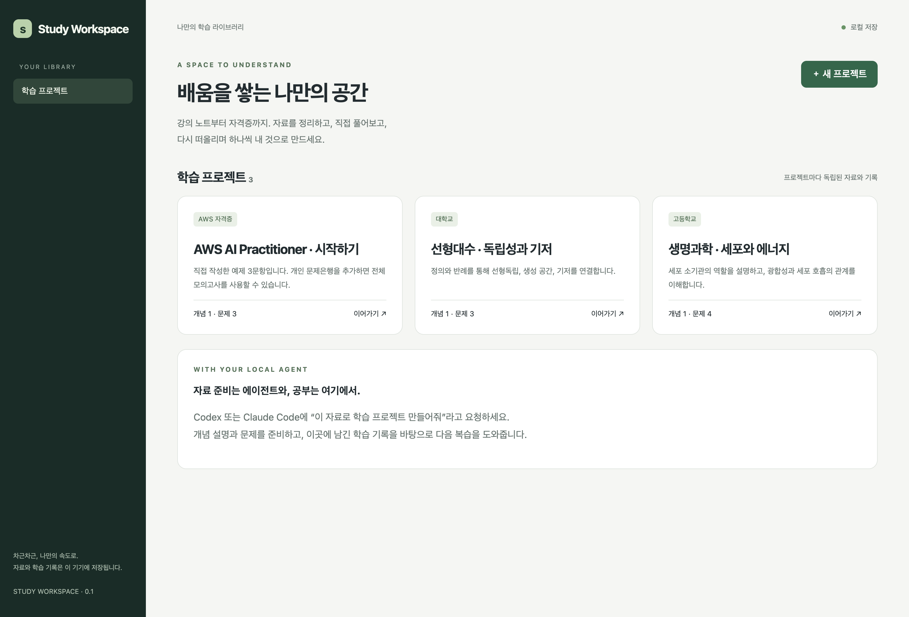

# Study Workspace

**A learning methodology, local GUI, and personal database — packaged as a plugin for Codex and Claude Code.**

Create an independent learning project for a high-school subject, university course, certification, or personal topic. Ask your local agent to organize source material into concepts and practice activities. Study in the browser, then bring your actual attempts and mistakes back to the agent for the next learning step.

The first release uses a Korean interface. Content can be authored in any language.



## Quick start

Requires **Python 3.10+ on macOS or Linux**. No npm, pip dependencies, build step, account, or separate model API key.

```sh
git clone https://github.com/pbc1017/study-workspace.git
cd study-workspace
python3 scripts/study.py doctor
python3 scripts/study.py demo --kind biology
python3 scripts/study.py demo --kind linear-algebra
python3 scripts/study.py open
```

`open` reuses the local server or starts one, chooses an available port, and opens the browser. Data lives in `~/.local/share/study-workspace`, outside this repository. Set `STUDY_WORKSPACE_HOME` or pass `--home /your/data/path` **before** the command to choose another location. Both agents must use the same data home to continue the same project.

## Install the plugin

### Claude Code

In Claude Code:

```text
/plugin marketplace add pbc1017/study-workspace
/plugin install study-workspace@pbc1017-study
```

For local development, launch `claude --plugin-dir /absolute/path/to/study-workspace`. The five skills are discovered under `skills/`. Start a new session after installation or updates.

### Codex

This repository includes the portable root `plugin.json` and a repo marketplace at `.agents/plugins/marketplace.json`. Open the cloned repository as a Codex project, restart the app if needed, and install **Study Workspace** from the repo's local marketplace.

For use across repositories, merge the following entry into your personal `~/.agents/plugins/marketplace.json` (preserve existing entries):

```json
{
  "name": "pbc1017-study",
  "plugins": [{
    "name": "study-workspace",
    "source": {
      "source": "url",
      "url": "https://github.com/pbc1017/study-workspace.git",
      "ref": "main"
    },
    "policy": {"installation": "AVAILABLE", "authentication": "ON_INSTALL"},
    "category": "Productivity"
  }]
}
```

Use the plugin browser in a supported local Codex client to enable it, then start a new chat. Host discovery can vary by client version; the standalone CLI works without plugin installation. See the [official packaging and local marketplace documentation](https://developers.openai.com/plugins/build/plugins).

Example prompts for either host:

> “Create a learning project for this semester's linear algebra class using these lecture notes.”
>
> “이 PDF로 생명과학 중간고사 프로젝트를 만들고, 개념 정리와 확인 문제를 준비해줘.”
>
> “Open my AWS project. Let's review the concepts behind my recent mistakes.”

## What is included

- **Project-specific pages:** home, materials, concepts, practice/exams, review, and history.
- **Five shared skills:** project setup, material authoring, study sessions, review coaching, and progress review.
- **Learning activities:** single choice, multiple choice, normalized short answers, rubric-based essay self-assessment.
- **Learning evidence:** saved answers, flags, source consultation, learner confidence, topic accuracy and distinct question counts.
- **Review:** mistake notes, tags, resolution state, and a transparent spaced-review heuristic.
- **Durable storage:** SQLite WAL, atomic imports, immutable question revisions, session snapshots, optimistic answer locking, and backups.
- **Source import:** UTF-8 Markdown/TXT/JSON and text PDFs. PDF extraction requires the optional `pdftotext` command from Poppler (`brew install poppler` on macOS).
- **AWS simulation preset:** 65 questions, 90 minutes, 50 scored + 15 unscored, 100–1000 simulated score and 700 passing threshold. This is an app scoring rule, not an official score prediction.

The sample projects contain newly authored teaching examples only. They are small demonstrations, not full courses or question banks.

## Bring your own content

```sh
python3 scripts/study.py create "Calculus — fall semester" --profile university
# Use the project ID returned above:
python3 scripts/study.py source PROJECT_ID /absolute/path/lecture.pdf
python3 scripts/study.py import PROJECT_ID /absolute/path/learning-pack.json --dry-run
python3 scripts/study.py import PROJECT_ID /absolute/path/learning-pack.json
```

Use the [learning pack format](skills/material-authoring/references/pack-format.md). Agents should write personal packs to the data home, not the public plugin checkout. Structural validation does not establish factual correctness: keep uncertain content in draft and review its sources.

For an existing local `alf-c01-practice` application:

```sh
python3 scripts/study.py migrate-aws /absolute/path/to/alf-c01-practice --dry-run
python3 scripts/study.py migrate-aws /absolute/path/to/alf-c01-practice
```

Migration reads a consistent, read-only snapshot of `data.db`, imports concepts and their keyword links, preserves sessions, answers, flags and marks, and checks saved scoring results before committing the new project. The old app remains usable. Repeating migration returns the previously created project; it does not synchronize subsequent changes. Private PDFs, question banks and personal records are never bundled with this plugin.

## Backup and runtime

```sh
python3 scripts/study.py backup /new/backup-directory
python3 scripts/study.py --home /new/backup-directory open
```

A backup contains a SQLite snapshot and registered source files; it can be opened directly as a data home. Project JSON export includes readable records and content, but importing that JSON restores **content only**, not historical attempts. Use the full backup for recovery.

For a foreground server: `python3 scripts/study.py serve --port 8765`; stop with Ctrl-C. A server started by `open` runs in the background; its PID and URL are recorded in the data home's `runtime.json`. Stop that PID before replacing runtime code. Never share `runtime.json`, which also contains the local session token.

## Privacy and current boundaries

The browser UI has no external assets, analytics, or model API calls. Its server listens on `127.0.0.1` and validates local sessions, Host, and Origin. Local applications running as the same OS user can access the same files; this is a personal workspace, not a multi-user security boundary.

**Local storage is not offline AI inference.** Material you ask Codex or Claude Code to interpret follows that host's model and data settings. The plugin does not launch an unattended AI worker. Generated content comes from the active agent; essay feedback may be discussed with the agent, while persisted essay scores are learner-confirmed self-assessments.

Version 0.1 does not include OCR, symbolic-math grading, code execution, cloud sync, arbitrary exam-preset editing, or a calibrated mastery model. Windows detached-runtime support is not implemented. Desktop/mobile layouts are supported in the local browser.

## Development

```sh
python3 -m unittest discover -s tests -v
python3 scripts/validate_plugin.py
# Optional JS syntax check when Node is installed:
node --check web/app.js
```

Tests cover project isolation, revision snapshots, retries, concurrency, grading, timeouts, review scheduling, backup/restore, legacy migration, and local HTTP access checks. See [architecture](docs/architecture.md), [methodology](docs/methodology.md), [CLI](docs/cli.md), and [validation notes](docs/validation.md).

MIT licensed. AWS names are used descriptively; this project is not affiliated with AWS.
