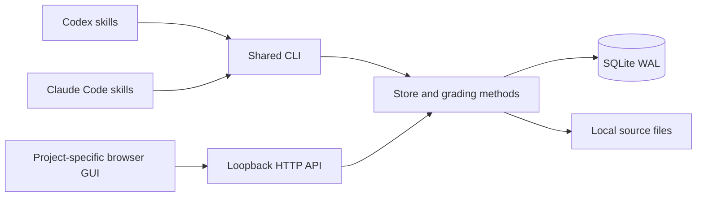

# Architecture and implementation status

## 1. Problem

A subject-specific mock-exam app hardcodes content, scoring and paths. A personal learning platform needs independent projects, source-grounded content, multiple activity types, durable attempts, and a method shared by Codex and Claude Code. The agent handles pedagogy and authoring; the runtime owns validation and records.

Version 0.1 is a usable local implementation, not the complete long-term platform. To avoid native Node ABI installation failures, the runtime uses Python's standard-library SQLite and HTTP server. The browser uses HTML/CSS/JavaScript without a build step. The existing applications were inspected for behavior; their private content is imported separately rather than redistributed.

## 2. Overview



CLI and HTTP use separate short-lived connections to the same SQLite database. SQLite transactions serialize writes; there is no separate queue daemon. Answer versions prevent lost updates. Skills read the same evidence through the CLI. Content imports are prepared by the active agent, not by an embedded model worker.

## 3. gRPC / REST API interface

gRPC: not applicable. CLI is the host-independent agent boundary. New local REST endpoints:

| Method | Path | Input / output |
|---|---|---|
| GET/POST | `/api/projects` | List / create `{title, description, profile}` |
| GET | `/api/projects/:id` | Project and scoring policy |
| GET | `/api/projects/:id/topics`, `/questions`, `/sources` | Project content; questions optionally filter by `?topic=` |
| POST | `/api/projects/:id/imports` | `{pack, dryRun}` → validated counts and hash; atomic upsert when committed |
| POST | `/api/projects/:id/sessions` | `{mode, count, topic, questionIds?, requestKey}` → session snapshot |
| GET | `/api/sessions/:id` | Active questions without answers, or submitted answers and feedback |
| PUT | `/api/sessions/:id/answers/:itemId` | `{answer, version, flagged?, hints?, confidence?}` → new version |
| POST | `/api/sessions/:id/submit` | Idempotent result with explicit pending count |
| POST | `/api/sessions/:id/assess/:itemId` | `{score, feedback}` → learner-confirmed essay result |
| GET | `/api/projects/:id/marks`, `/history`, `/progress`, `/export` | Project-scoped learning records |
| PUT | `/api/projects/:id/marks/:questionId` | `{tags, memo, resolved}` → save |

Errors: 401 missing local session, 403 invalid origin/host, 404 missing resource, 409 version/state conflict, 413 body size, 415 media type, 422 invalid content. Source file access is CLI-only. Personal-scale lists are currently unpaginated; a future version should add cursor pagination before supporting very large banks. Imports accept up to 10,000 questions and HTTP bodies up to 16 MB.

No old application endpoint is replaced in place. Migration produces a separate project in a new database. Content packs use `schemaVersion: 1`; SQLite uses `user_version: 1` and refuses newer schemas.

## 4. DB model

All models below are new in this standalone plugin; comments describe their relationship to the legacy app. Actual SQL is in `study_workspace/store.py`.

```ts
struct Project { // Added: replaces hardcoded subject identity
  id PK; title; description; profile; policyJson; createdAt;
}
struct Source { // Added
  id PK; projectId FK; title; contentHash; relativePath; kind; createdAt;
  UNIQUE(projectId, contentHash);
}
struct Topic { // Added: concepts no longer come from fixed source code
  projectId FK; id; title; body; objectivesJson; sourceRefsJson; position;
  PRIMARY_KEY(projectId, id);
}
struct Question { // Changed: identity is scoped to project
  projectId; id; number; revision; payloadJson; active;
  PRIMARY_KEY(projectId, id);
}
struct QuestionRevision { // Added: immutable content history
  projectId; questionId; revision; payloadJson;
  PRIMARY_KEY(projectId, questionId, revision);
  FOREIGN_KEY(projectId, questionId) -> Question;
}
struct Import { // Added: retry deduplication
  projectId FK; contentHash; reportJson; createdAt;
  PRIMARY_KEY(projectId, contentHash);
}
struct Session { // Changed: project scope and frozen policy
  id PK; projectId FK; mode; policyJson; startedAt; expiresAt?;
  finishedAt?; status; resultJson?; requestKey;
  UNIQUE(projectId, requestKey);
}
struct Item { // Changed: frozen question plus typed response
  id PK; sessionId FK; questionId; snapshotJson; position; scored;
  answerJson; flagged; hints; confidence?; version;
  score?; feedback; gradeStatus;
  UNIQUE(sessionId, position);
}
struct Mark { // Changed: stable identity instead of global question number
  projectId; questionId; tagsJson; memo; resolved; dueAt?; streak; updatedAt;
  PRIMARY_KEY(projectId, questionId);
  FOREIGN_KEY(projectId, questionId) -> Question;
}
```

Project/session/due indexes support common queries. Learning objectives and topic links are embedded in content JSON in this version, not separate relational entities. Progress derives from persisted items; no stored mastery claim is made. Original and generated questions are explicitly labeled. The standalone schema does not yet include agent evaluation jobs or provisional evaluation history.

Migration reads the old DB through a read-only connection into a consistent SQLite snapshot. A separate staging database validates all content and saved scores. Only then are all tables inserted into the destination transaction. Legacy result payloads remain available in exported history. A path-based migration marker prevents duplicate one-time imports. The source is not changed. Backups use SQLite's backup API and copy immutable registered source files; restore by opening a new data home.

## 5. Edge cases and recovery

- Concurrent answers: expected version is checked under `BEGIN IMMEDIATE`; stale saves return 409. Reload instead of overwriting.
- Repeated start/submit: request keys deduplicate session creation; submission and review changes share one transaction.
- Changed content: revisions and session snapshots preserve the question and scoring interpretation used when the session started.
- PDF/OCR: empty text extraction is rejected; no invented text or unattended OCR fallback.
- Incorrect or ambiguous generated answers: keep content draft; schema checks cannot prove factual correctness.
- Essays: submitted text remains pending until learner self-assessment. Exact-string matching is never used for proof equivalence.
- Expired exams: deadline is persisted and checked on session access/answer save. Reopening an expired session submits it. No always-on timer worker is necessary.
- Incomplete/malformed import: validate first, commit in one transaction. No partial topic overwrite after a failed question validation.
- Source file + DB boundary: files are written before the source row. A crash can leave an unreferenced immutable file, but not a source row pointing to an unwritten file. Orphan cleanup is not implemented yet.
- Multiple open commands: a local startup lock prevents competing launches. Runtime binds loopback, reuses a matching version and falls back to a free port.
- Security boundary: origin/host checks and same-site local cookie protect browser access. The same OS user can access the DB, CLI and private token; this is intentionally not a multi-user server.
- Very large courses: lists are unpaginated and content is loaded in memory. This release targets personal-scale courses; pagination and streaming extraction remain future work.

## Next iterations

Add first-class objective relationships and editable non-AWS exam presets; preserve provisional agent evaluations separately; support resumable OCR extraction; add content editing and review inside the GUI; test more installation surfaces. Keep the existing learning data backward-compatible through explicit schema migrations.
